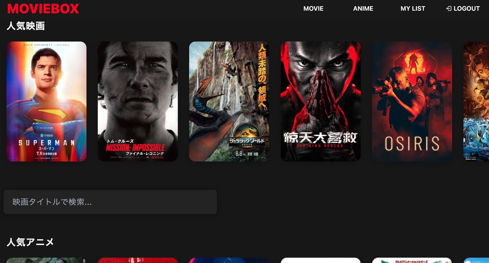

## "MOVIEBOX"の概要
お気に入りの映画やアニメ、見たい作品を自分のリストに追加して
直感的に自分だけのマイリストを作るwebアプリケーション

### 作成動機
映画やアニメの視聴した作品や、今後見たい作品のランキングをメモアプリに残していました。
リストが増えるごとに、より手軽に検索できたりサムネイル付きの作品を追加して簡単にリストが作成できるアプリがあればいいなと思い作成しました。
具体的なデザインは某有名動画配信サービスのデザインを参考にしております。

## 主な機能

### ユーザー関連
<ul>
  <li>映画、アニメ人気リストを自動表示(1位の作品をトップに)</li>
  <li>映画、アニメ作品の検索機能</li>
  <li>映画、アニメ作品の詳細ページを表示</li>
  <li>ログイン機能 (Google)</li>
  <li>マイリストに作品を追加、削除</li>
  <li>ログイン状態でマイリストの取得</li>
  <li>ロゴをクリックするとトップページに推移</li>
  <li>メニューリストをクリックすると、そのリストにスライド(詳細ページからはtopページに飛んでからスライド)</li>
  <li>リスト追加や削除、ログインやログアウト時のトースト表示</li>
</ul>

### その他

<ul>
<li>レシポンシブ対応(スマホサイズだとハンバーガーメニューになる)</li>
<li>リストをDBに保管</li>
</ul>

## こだわったポイント
<li>トースト表示で操作時の煩わしさをできるだけ軽減した</li>
<li>人気アニメにフィルターをかけ、教育系のアニメ等のジャンルを省いた</li>
<li></li>

## 仕様スタック

<li>Frontend</li>
React  
TypeScript  
Tailwind CSS  

<li>Backend/DB</li>
Firebase Auth  
Firestore  

<li>CI/CD</li>
Vercel  

<li>Souce Code Management</li>
Git/Github  

<li>Others</li>
Visual Studio Code
TMDB API  

### 制作期間

約1ヶ月半

## ER図

##　画面遷移図
Figma

## 今後の予定
<ul>
  <li>topページから+ボタンを押すことでリストに追加</li>
  <li>追加済み作品には右上に✔︎を表示</li>
  <li>マイページの実装</li>
  <li>ランキング作成機能</li>
  <li>作品のレビュー機能/li>
  <li>リスト共有機能/li>
  <li>おすすめ関連作品を表示機能</li>
</ul>
